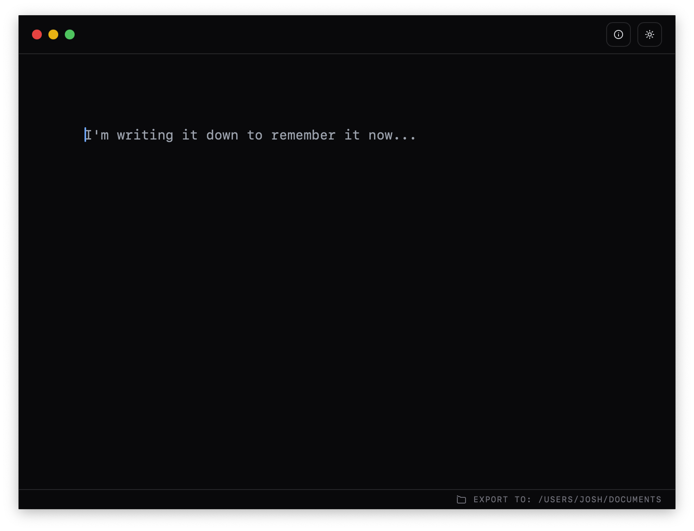
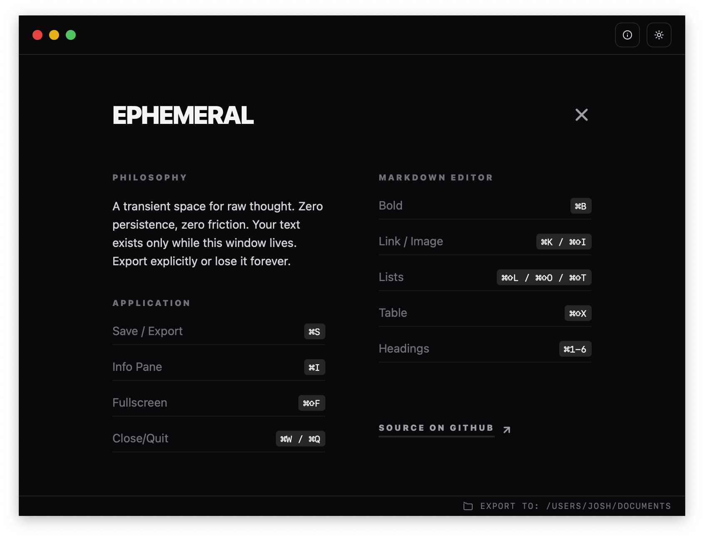

# Ephemeral

Ephemeral is a minimalist writing tool built with Tauri. It intentionally never auto-saves and never prompts on close. Text persists only when you explicitly export it.

## Installation

### Download
Download the latest version from [GitHub Releases](https://github.com/whaleen/ephemeral/releases/latest).

### Build from source
Requires [Bun](https://bun.sh/) and the [Rust toolchain](https://www.rust-lang.org/tools/install).

```bash
bun install
bun run tauri build
```

The app bundle will be generated in `src-tauri/target/release/bundle/`.

## Screenshots




## Philosophy

- No auto-save
- No save prompts
- Manual export only
- Non-destructive exports (auto-incremented names)

## Features

- Markdown writing with rich formatting
- Export to `.md` or `.txt`
- Custom filename on export
- Configurable export directory
- Last export quick-reveal in Finder
- System theme support

## Usage

1. Open the app and start writing.
2. Press `Cmd/Ctrl + S` to export.
3. Enter a filename, then choose `Markdown` or `Text`.
4. Use the export directory control in the footer to change destination.

## Keyboard Shortcuts

- Save / Export: `Cmd/Ctrl + S`
- Info Pane: `Cmd/Ctrl + /`
- Toggle Markdown Mode: `Cmd/Ctrl + M`
- Set Export Folder: `Cmd/Ctrl + E`
- Close/Quit: `Cmd/Ctrl + W` or `Cmd/Ctrl + Q`
- Fullscreen: `Cmd/Ctrl + Shift + F`
- Bold: `Cmd/Ctrl + B`
- Headings: `Cmd/Ctrl + 1-6`
- Link: `Cmd/Ctrl + K`
- Image: `Cmd/Ctrl + Shift + I`
- Table: `Cmd/Ctrl + Shift + X`

For development setup and release workflow details, see `DEVELOPER.md`.
